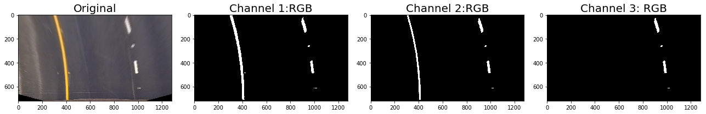
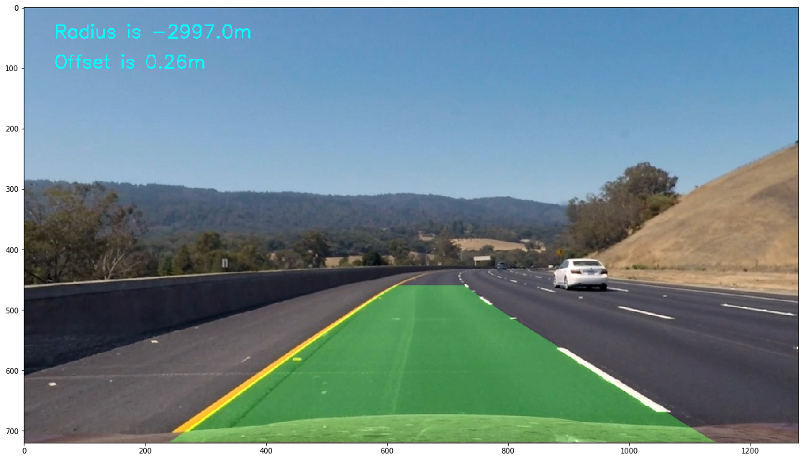

## Advanced Lane Finding
[](http://www.udacity.com/drive)


**Advanced Lane Finding Project**

The goals / steps of this project are the following:

* Compute the camera calibration matrix and distortion coefficients given a set of chessboard images.
* Apply a distortion correction to raw images.
* Use color transforms, gradients, etc., to create a thresholded binary image.
* Apply a perspective transform to rectify binary image ("birds-eye view").
* Detect lane pixels and fit to find the lane boundary.
* Determine the curvature of the lane and vehicle position with respect to center.
* Warp the detected lane boundaries back onto the original image.
* Output visual display of the lane boundaries and numerical estimation of lane curvature and vehicle position.

## [Rubric](https://review.udacity.com/#!/rubrics/571/view) Points

### Here I will consider the rubric points individually and describe how I addressed each point in my implementation.  

---

### Writeup / README

You're reading it! The code of the whole project except camera calibration is available in [Pipeline.ipynb](Pipeline.ipynb).

### Camera Calibration

#### 1. Briefly state how you computed the camera matrix and distortion coefficients. Provide an example of a distortion corrected calibration image.

The code for this step is contained in the file [Calibrate_Camera.ipynb](Calibrate_Camera.ipynb) and [Validate_Calibration.ipynb](Validate_Calibration.ipynb)

I start by preparing "object points", which will be the (x, y, z) coordinates of the chessboard corners in the world. Here I am assuming the chessboard is fixed on the (x, y) plane at z=0, such that the object points are the same for each calibration image.  Thus, `objp` is just a replicated array of coordinates, and `objpoints` will be appended with a copy of it every time I successfully detect all chessboard corners in a test image.  `imgpoints` will be appended with the (x, y) pixel position of each of the corners in the image plane with each successful chessboard detection.  

I then used the output `objpoints` and `imgpoints` to compute the camera calibration and distortion coefficients using the `cv2.calibrateCamera()` function.  I applied this distortion correction to the test image using the `cv2.undistort()` function and obtained this result: 

<p align="center">
  
  <br>
  <b>Camera Calibration</b>
</p>

### Pipeline (single images)

#### 1. Provide an example of a distortion-corrected image.

To demonstrate this step, I will describe how I apply the distortion correction to one of the test images like this one:
<p align="center">
  
  <br>
  <b>Distortion Corrected Image</b>
</p>


#### 2. Describe how (and identify where in your code) you used color transforms, gradients or other methods to create a thresholded binary image.  Provide an example of a binary image result.

Initially I was doing the transforms and then the perspective transform. But then I realized that it is easier to the perspective transform and then to the color transforms. 

I first explored a couple of color spaces and tried to identify which channels to select. 
<p align="center">
  
  <br>
  <b>RGB</b>
</p>
<p align="center">
  
  <br>
  <b>HLS</b>
</p>
<p align="center">
  
  <br>
  <b>LUV</b>
</p>
<p align="center">
  
  <br>
  <b>LAB</b>
</p>

This gave me some idea about which color shows up on which space. Additionally, I also had to use the Sobel operator to get additional results. 
<p align="center">
  
  <br>
  <b>Sobel Grad X and Mag</b>
</p>
The performance of Sobel DIR was somehow not good (or maybe I was not able to use it correctly)

Post color spaces and Sobel operations, the lanes looked like the picture shown below. 
<p align="center">
  
  <br>
  <b>Combined</b>
</p>

#### 3. Describe how (and identify where in your code) you performed a perspective transform and provide an example of a transformed image.

At the beginning of the section I was planning to tackle the challenge and harder challenge videos as well.. :) While I didnt eventually get around to doing those, my transform has the potential to select different lengths of the road ahead. The second cell has the relevant details. Reproducing here as well. 

```python
    src = np.zeros((4, 2), dtype=np.float32)
    
    if SPEED == 0: # High speed - longer view
        # Long
        src[0] = [610,440]
        src[1] = [670,440]
        src[2] = [1130,720]
        src[3] = [190,720]
    elif SPEED == 1:
        # Medium
        src[0] = [560,460]
        src[1] = [720,460]
        src[2] = [1230,720]
        src[3] = [50,720]
    elif SPEED == 2:      
        #Short
        src[0] = [480,500]
        src[1] = [800,500]
        src[2] = [1230,720]
        src[3] = [50,720]
    
    # Destination Points
    dst = np.zeros((4, 2), dtype=np.float32)
    width = img.shape[1]
    height = img.shape[0]
    offset1 = 250 # offset for dst points
    offset2 = 150
    dst[0] = (offset1, 0)
    dst[1] = (width-offset1, 0)
    dst[2] = (width-offset1, height)
    dst[3] = (offset1, height)
```

This resulted in the following source and destination points:

| Source        | Destination   | 
|:-------------:|:-------------:| 
| 560, 460      | 250, 0        | 
| 720, 460      | 1030, 0       |
| 1230, 720     | 1030, 720     |
| 50, 720       | 250, 0        |

I verified that my perspective transform was working as expected by drawing the `src` and `dst` points onto a test image and its warped counterpart to verify that the lines appear parallel in the warped image. The `medium` value was finally used.

<p align="center">
  
  <br>
  <b>Birds Eye View - Straight Road (Short, Long Perspective)</b>
</p>

<p align="center">
  
  <br>
  <b>Birds Eye View - Curved Section (Short, Long Perspective)</b>
</p>

#### 4. Describe how (and identify where in your code) you identified lane-line pixels and fit their positions with a polynomial?

I used the Udacity course recommended lane line pixel finding technique in the function `find_lane_pixels_no_history`. I modified it to a) find the vehicle offset and b) to increase the size of the window when there is no data found and c) include a confidence value on the lane identification. I expanded the window to handle the curved dashed lines which would otherwise go out of scope. The confidence value tells how many of the 9 windows actually had significant data. This proved extremely valuable later on.

<p align="center">
  
  <br>
  <b>Polynomial Fitted Lane with confidence values(both perspectives)</b>
</p>


#### 5. Describe how (and identify where in your code) you calculated the radius of curvature of the lane and the position of the vehicle with respect to center.

The radius of curvature was identified in the function `measure_curvature_real`. The xm_per_pix and ym_per_pixel values were calculated on the birds eye view images for both perspectives. The position of the vehicle wrt the center was calculated in the `find_lane_pixels_no_history` function. 

The output looked like this, 
<p align="center">
  
  <br>
  <b>Radius and Offset</b>
</p>

#### 6. Provide an example image of your result plotted back down onto the road such that the lane area is identified clearly.

In the `process_images` function the lanes were plotted back on the road using Udacity's code. :) 
<p align="center">
  
  <br>
  <b>Lane Identification</b>
</p>


---

### Pipeline (video)

#### 1. Provide a link to your final video output.  Your pipeline should perform reasonably well on the entire project video (wobbly lines are ok but no catastrophic failures that would cause the car to drive off the road!).

Here's a [link to my video result](./project_video.mp4)

---

### Discussion

#### 1. Briefly discuss any problems / issues you faced in your implementation of this project.  Where will your pipeline likely fail?  What could you do to make it more robust?

Here I'll talk about the approach I took, what techniques I used, what worked and why, where the pipeline might fail and how I might improve it if I were going to pursue this project further.  
